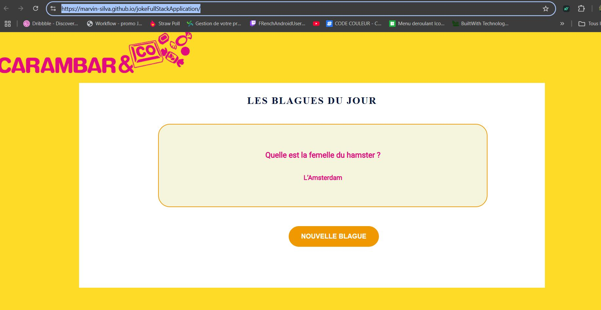
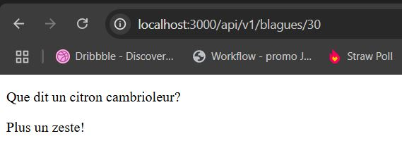

# Backend appllication

## Routes:
### Ajouter une blague

#### pour ajouter une blague, il suffit de se rendre sur la route : 
    http://localhost:3000/api/v1/add/joke

    Voici un aperçu:

    

     

    POV: ne pas oublier le corps de la requêtes